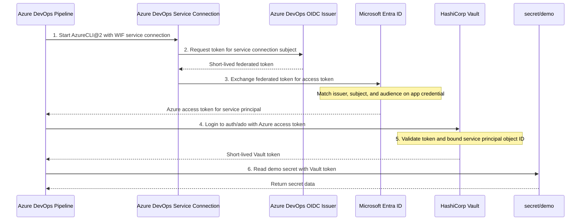

# Azure DevOps + HashiCorp Vault Integration with Workload Identity Federation

This Terraform configuration creates an Azure DevOps pipeline integration with HashiCorp Vault using Azure DevOps Workload Identity Federation and the Vault Azure auth backend.

## Architecture Overview

Terraform builds three connected parts of the integration:

- **Azure DevOps control plane** - A project, Git repository, build definition, `simple-vault-pipeline.yml`, service connection, environment, and pipeline permissions.
- **Azure identity plane** - A Microsoft Entra application, service principal, subscription role assignment, and federated identity credential that trusts the Azure DevOps service connection.
- **Vault control plane** - A KV v2 mount, demo secret, Azure auth backend, Azure auth configuration, policy, and role bound to the service principal object ID.

```
                         Terraform apply
                                │
             ┌──────────────────┼──────────────────┐
             │                  │                  │
             ▼                  ▼                  ▼
    Azure DevOps project  Microsoft Entra ID  HashiCorp Vault
    repo + pipeline       app + service       auth/ado + policy
    service connection    principal + WIF     secret/demo
             │                  │                  │
             └──────────────────┼──────────────────┘
                                │
                                ▼
            Pipeline gets Azure token, logs into Vault,
            receives a Vault token, then reads secret/demo.
```

**Runtime Authentication Flow:**
1. Azure DevOps runs the `AzureCLI@2` task with the configured Workload Identity Federation service connection.
2. Azure DevOps requests a short-lived federated token for the service connection.
3. Microsoft Entra ID exchanges that federated token for an Azure access token for the configured service principal.
4. The pipeline passes the Azure access token to Vault's Azure auth backend.
5. Vault validates the token, checks that it belongs to the bound service principal object ID, and returns a short-lived Vault token.
6. The pipeline uses the Vault token to read the demo secret.



### Mapping the Flow to Pipeline Code

Some of the authentication steps are handled by Azure DevOps and Azure CLI rather than appearing as separate Bash commands in the script.

- **Step 1** starts at the `AzureCLI@2` task. The `azureSubscription` input points the task at the Azure DevOps service connection created by Terraform.
- **Step 2** is implicit. Because the service connection uses `WorkloadIdentityFederation`, Azure DevOps requests the short-lived federated token for that service connection behind the scenes.
- **Step 3** is completed when Azure CLI is authenticated as the configured service principal and the script asks for an Azure access token:

```bash
JWT=$(az account get-access-token --resource https://management.core.windows.net/ --query accessToken --output tsv)
```

The variable is named `JWT` because the Azure access token is JWT-formatted. In this default flow, it contains the Azure access token returned by Azure CLI, not the raw Azure DevOps federated token.

- **Steps 4 and 5** happen when the script sends that Azure access token to Vault:

```bash
vault write -format=json auth/ado/login role="ado-pipeline-role" jwt="$JWT"
```

Vault validates the token, checks that it belongs to the configured service principal object ID, and returns a Vault token.

- **Step 6** is the secret read after the Vault token has been exported:

```bash
vault kv get secret/demo
```

## Security Notes

- **No Azure DevOps service principal secret** - The service connection uses Workload Identity Federation instead of storing a client secret in Azure DevOps.
- **Federated credential on the Entra application** - Terraform creates the trust between the Azure DevOps service connection subject and the Entra application.
- **Service principal binding in Vault** - The Vault role is bound to the service principal object ID, matching the `oid` claim in the Azure token.
- **No subscription binding in Vault** - The Vault role intentionally leaves `bound_subscription_ids` empty for the Azure DevOps pipeline flow.
- **Protect Terraform state** - Terraform creates an Azure application password for Vault's Azure auth backend and demo Vault secret data. Treat local and remote state as sensitive.

## Quick Start

### 1. Prerequisites

- Azure CLI authenticated (`az login --tenant your-tenant-name`)
- Terraform installed
- HashiCorp Vault server running and accessible
- Azure DevOps organization with admin access
- Agent pool with an agent that can reach Vault and has the required tools available. The pipeline expects Azure CLI and Vault CLI; the template installs `jq` if it is missing.

### 2. Set Environment Variables (Recommended)

```bash
# Azure Configuration (auto-detect current context)
export TF_VAR_azure_tenant_id=$(az account show --query tenantId -o tsv)
export TF_VAR_azure_subscription_id=$(az account show --query id -o tsv)

# Azure DevOps Configuration
export TF_VAR_azuredevops_org_service_url="https://dev.azure.com/your-organization"
export TF_VAR_azuredevops_personal_access_token="your-azure-devops-pat-token"

# HashiCorp Vault Configuration
export VAULT_ADDR="https://your-vault-server.com:8200"
export VAULT_TOKEN="your-vault-admin-token"
export VAULT_SKIP_VERIFY="1"  # If using self-signed certificates
export TF_VAR_vault_addr="$VAULT_ADDR"
```

### 3. Deploy Infrastructure

```bash
terraform init
terraform apply
```

## What Gets Created

### Azure Resources
- **Microsoft Entra application** - Service principal identity
- **Service Principal** - With Owner role on subscription  
- **Federated Identity Credential** - Links to Azure DevOps service connection
- **Role Assignment** - Owner permissions on subscription

### Azure DevOps Resources  
- **Project** - With randomized name (e.g., `vault-wif-a1b2c3`)
- **Git Repository** - Ready for pipeline code
- **Build Pipeline** - Configured to use `simple-vault-pipeline.yml`
- **Service Connection** - Using Workload Identity Federation (passwordless)
- **Environment** - Development environment for deployments
- **Pipeline Authorizations** - Permissions for service connection, agent queue, environment

### HashiCorp Vault Resources
- **KV v2 Secrets Engine** - Mounted at `secret/`
- **Demo Secret** - `secret/demo` with test credentials
- **Azure Auth Backend** - Mounted at `auth/ado`
- **Azure Auth Configuration** - Service principal credentials for validation
- **Pipeline Policy** - Read access to `secret/data/demo`
- **Pipeline Role** - `ado-pipeline-role` bound to service principal object ID

## Key Configuration Details

### Vault Role Configuration

The Vault Azure auth role is configured with:

```hcl
resource "vault_azure_auth_backend_role" "ado_pipeline_role" {
  backend         = vault_auth_backend.ado.path
  role            = "ado-pipeline-role"
  token_policies  = ["ado-pipeline-policy"]
  
  # Critical: Use object_id, not client_id (matches JWT oid field)
  bound_service_principal_ids = [azuread_service_principal.vault_sp.object_id]
  
  # No subscription binding needed for Azure DevOps pipelines
  bound_subscription_ids = []
  
  token_ttl     = 3600
  token_max_ttl = 7200
  token_type    = "batch"
}
```

**Important**: The `bound_service_principal_ids` must use the service principal's **object ID**, not client ID, as it matches the `oid` field in the JWT token.

### Pipeline Authentication

The pipeline uses Vault CLI for authentication:

```bash
# Get JWT token from Azure CLI
JWT=$(az account get-access-token --resource https://management.core.windows.net/ --query accessToken --output tsv)

# Authenticate with Vault (no subscription_id needed)
vault write -format=json auth/ado/login role="ado-pipeline-role" jwt="$JWT"
```

The current template relies on the Azure CLI login created by `AzureCLI@2`, then asks Azure CLI for an Azure access token. If a pipeline needs direct access to the Workload Identity Federation token, `AzureCLI@2` can also expose the service connection identity values to the script:

```yaml
- task: AzureCLI@2
  inputs:
    azureSubscription: '<service_endpoint_name>'
    scriptType: 'bash'
    scriptLocation: 'inlineScript'
    addSpnToEnvironment: true
    inlineScript: |
      echo "Service principal: $servicePrincipalId"
      echo "Tenant: $tenantId"
      # The workload federation token is available as $idToken.
```

Use this option when the script needs the raw federated token or service principal metadata. It is not required for the default pipeline because `az account get-access-token` is enough for the Vault Azure auth flow used here.

## Environment Variables and Terraform Variables

### Environment Variables (Recommended)

| Variable | Description | Required |
|----------|-------------|----------|
| `TF_VAR_azure_tenant_id` | Azure tenant ID | Yes |
| `TF_VAR_azure_subscription_id` | Azure subscription ID | Yes |
| `TF_VAR_azuredevops_org_service_url` | Azure DevOps organization URL | Yes |
| `TF_VAR_azuredevops_personal_access_token` | Azure DevOps PAT | Yes |
| `VAULT_ADDR` | HashiCorp Vault server URL | For Vault resources |
| `VAULT_TOKEN` | Vault admin token | For Vault resources |
| `VAULT_SKIP_VERIFY` | Skip TLS verification | For self-signed certs |
| `TF_VAR_vault_addr` | Vault address rendered into the pipeline YAML | Required for pipeline runs |

### Terraform Variables

Alternatively, set these in `terraform.tfvars`:

```hcl
# Azure Configuration
azure_tenant_id       = "your-tenant-id"
azure_subscription_id = "your-subscription-id"

# Azure DevOps Configuration
azuredevops_org_service_url       = "https://dev.azure.com/your-org"
azuredevops_personal_access_token = "your-pat-token"

# Project Configuration
azuredevops_project_name = "vault-wif"
project_visibility       = "private"
service_endpoint_name    = "AzureRM Service Connection for Vault with Automatic WIF"

# Vault Configuration
vault_addr = "https://your-vault-server.com:8200"
```

## Creating Personal Access Token

1. Go to Azure DevOps > User Settings > Personal Access Tokens
2. Click "New Token"
3. Set required scopes:
   - **Project and Team (Read & Write)** - To create projects
   - **Service Connections (Read & Write)** - To create service connections
   - **Build (Read & Write)** - To create pipelines
   - **Environment (Read & Write)** - To create environments
4. Copy the token and set it as `TF_VAR_azuredevops_personal_access_token`

## Pipeline Templates

The repository includes four pipeline templates, but Terraform only deploys one of them. The active pipeline is controlled in `ado-project.tf` by `yml_path = "simple-vault-pipeline.yml"`, and Terraform only writes `templates/simple-vault-pipeline.yml` into the generated Azure DevOps repository.

### 1. `simple-vault-pipeline.yml` (Primary)
- Complete Vault authentication workflow
- JWT token acquisition and validation
- Secret retrieval with error handling
- Token cleanup and security best practices
- Used by the created build pipeline

### 2. `jwt-debug-pipeline.yml` (Unused debug template)
- Decodes and displays JWT token contents
- Useful for troubleshooting authentication issues
- Shows token metadata and structure
- Not uploaded to the generated Azure DevOps repository by Terraform

### 3. `azure-pipelines.yml` (Unused advanced example)
- Advanced pipeline with multiple authentication methods
- Comprehensive error handling and fallback logic
- Environment-specific configurations
- Not referenced by the Terraform build definition

### 4. `vault-auth-pipeline.yml` (Unused auth example)
- Focused on Vault authentication patterns
- Different auth backend examples
- Token management best practices
- Not referenced by the Terraform build definition

## Usage Example

After deployment, Terraform writes `simple-vault-pipeline.yml` into the created Azure DevOps repository and configures the build definition to use that file:

```yaml
# The created simple-vault-pipeline.yml includes:
trigger:
- main

pool: Default

variables:
  VAULT_ADDR: 'https://your-vault-server.com:8200'
  VAULT_SKIP_VERIFY: '1'

jobs:
- job: VaultDemo
  displayName: 'Simple Vault Integration Demo'
  steps:
  - task: AzureCLI@2
    displayName: 'Get Secret from Vault'
    inputs:
      azureSubscription: '<service_endpoint_name>'
      scriptType: 'bash'
      scriptLocation: 'inlineScript'
      inlineScript: |
        # Get JWT token
        JWT=$(az account get-access-token --resource https://management.core.windows.net/ --query accessToken --output tsv)
        
        # Authenticate with Vault
        vault write -format=json auth/ado/login role="ado-pipeline-role" jwt="$JWT" > /tmp/vault_response.json
        VAULT_TOKEN=$(cat /tmp/vault_response.json | jq -r '.auth.client_token')
        
        # Read secret
        vault kv get secret/demo
        
        # Clean up
        vault token revoke -self
```

## Cleanup

To remove all created resources:

```bash
terraform destroy
```

This automatically removes:
- Microsoft Entra application and service principal
- All role assignments
- Azure DevOps project, repository, pipeline, and service connection
- Vault auth backend, policies, and roles

## Agent Pool

If you don't want to use a Microsoft-hosted agent pool, set up a self-hosted agent on a local VM or a cloud VM.

Depending on what the pipeline needs, pre-install the tools on the VM. For this pipeline, the agent should have the Vault CLI available so the `vault` commands can run without installing everything during each pipeline execution.

You only need to set up the agent once as long as you keep using the same org, pool name, and PAT.

## Troubleshooting

### Authentication Failures

**Error: "service principal not authorized"**

**Solution**: Ensure Vault role uses service principal **object ID**, not client ID:

```bash
# Check current configuration
vault read auth/ado/role/ado-pipeline-role

# Should show: bound_service_principal_ids = [object-id-from-jwt]
# JWT oid field must match bound_service_principal_ids
```

**Error: "bound_subscription_ids" preventing authentication**

**Solution**: Remove subscription constraints (not needed for pipelines):

```bash
vault write auth/ado/role/ado-pipeline-role \
  bound_service_principal_ids="object-id" \
  bound_subscription_ids="" \
  policies="ado-pipeline-policy"
```

### Service Connection Issues

1. **Wait for propagation** - Microsoft Entra ID changes can take 5-10 minutes
2. **Check federated credential** in Azure Portal > App registrations
3. **Verify issuer, subject, and audience** match the service connection's Workload Identity Federation values

### Vault Connectivity Issues

1. **Set VAULT_SKIP_VERIFY=1** for self-signed certificates
2. **Check network connectivity** from pipeline agent to Vault
3. **Verify Vault auth backend** is mounted at `auth/ado`

### Permission Issues

**For Microsoft Entra operations**: Need "Application Administrator" role
**For Azure subscription**: Need "Owner" or "Contributor" role  
**For Azure DevOps**: Need "Project Administrator" permissions

## Security Best Practices

1. **Use Environment Variables** - Keep secrets out of code
2. **Protect Terraform State** - State can contain the Azure application password, Vault auth configuration details, and demo secret values
3. **Rotate PAT Tokens** - Set shorter expiration periods
4. **Limit PAT Scopes** - Only grant required permissions
5. **Monitor Service Principals** - Regularly audit permissions
6. **Use Vault Policies** - Restrict secret access paths
7. **Token Cleanup** - Always revoke Vault tokens after use
8. **Network Security** - Restrict Vault access to pipeline agents

## Multi-Environment Setup

For production deployments, consider:

### Option 1: Multiple Service Principals
```hcl
# Create environment-specific service principals
resource "azuread_service_principal" "vault_sp_prod" { ... }
resource "azuread_service_principal" "vault_sp_dev" { ... }

# Create environment-specific Vault roles
resource "vault_azure_auth_backend_role" "ado_pipeline_role_prod" {
  role = "ado-pipeline-role-prod"
  bound_service_principal_ids = [azuread_service_principal.vault_sp_prod.object_id]
  token_policies = ["prod-policy"]
}
```

### Option 2: Microsoft Entra Group-Based
```hcl
# Create groups for environments
resource "azuread_group" "vault_prod_group" {
  display_name = "vault-prod-pipelines"
}

# Bind Vault roles to groups
resource "vault_azure_auth_backend_role" "ado_pipeline_role_prod" {
  role = "ado-pipeline-role-prod"
  bound_group_ids = [azuread_group.vault_prod_group.object_id]
  token_policies = ["prod-policy"]
}
```

## Additional Resources

- [HashiCorp Blog: Integrating Azure DevOps with Vault](https://www.hashicorp.com/en/blog/integrating-azure-devops-pipelines-with-hashicorp-vault)
- [Vault Azure Auth Method](https://developer.hashicorp.com/vault/docs/auth/azure)
- [Azure Workload Identity Federation](https://docs.microsoft.com/en-us/azure/active-directory/workload-identities/workload-identity-federation)
- [Azure DevOps Service Connections](https://docs.microsoft.com/en-us/azure/devops/pipelines/library/service-endpoints)
- [Vault Policies](https://developer.hashicorp.com/vault/docs/concepts/policies)

## File Structure

```
terraform/
|-- README.md                    # This file
|-- main.tf                      # Provider configurations
|-- variables.tf                 # Input variables
|-- outputs.tf                   # Output values
|-- azure-sp.tf                  # Microsoft Entra resources
|-- ado-project.tf               # Azure DevOps resources
|-- vault-config.tf              # Vault configuration
`-- templates/
  |-- simple-vault-pipeline.yml    # Primary working template
  |-- jwt-debug-pipeline.yml       # JWT debugging
  |-- azure-pipelines.yml          # Advanced template
  `-- vault-auth-pipeline.yml      # Auth-focused template
```